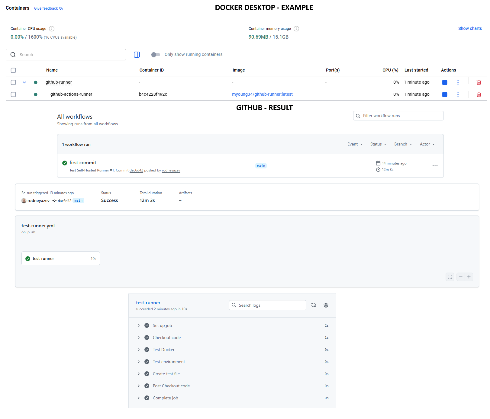
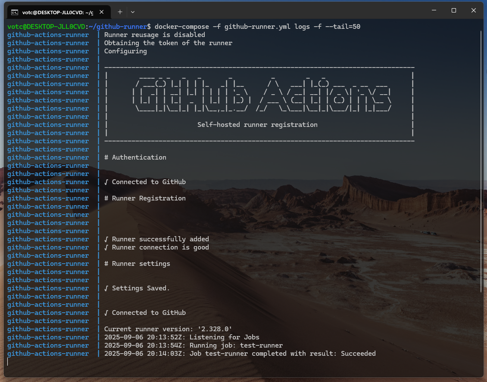

#### Make sure <strong>ACCESS_TOKEN</strong> and <strong>REPO_URL</strong> are defined in the compose file (github-runner.yml)

- ACCESS_TOKEN = {Your GitHub Token Here}
- REPO_URL = {Your Repository URL}

#### GitHub Actions file example:
```bash
.github/workflows/test-runner.yml
```

### Example:




## Setup Instructions:
Create a Personal Access Token:

Go to GitHub → Settings → Developer settings → Personal access tokens

Generate a token with repo and admin:org (for organization runners) or admin:repo_hook permissions

Configure the runner:

For organization runners: REPO_URL=https://github.com/your-organization

For repository runners: REPO_URL=https://github.com/your-username/your-repo

### Example:

# Start the runner/docker
docker compose -f github-runner.yml up -d

# Check result
docker-compose -f github-runner.yml logs -f --tail=50

# Get shell access to the runner container
docker exec -it github-actions-runner /bin/bash

# Check what's happening inside
ps aux
ls -la /tmp/runner-work/

# Check if container is healthy
docker-compose -f github-runner.yml ps

# Check resource usage
docker stats github-actions-runner

# Check network connectivity
docker exec github-actions-runner ping -c 3 github.com

# Check Docker daemon access (important for workflows)
docker exec github-actions-runner docker info

# Check runner process
docker exec github-actions-runner ps aux | grep runner

# Check environment variables
docker exec github-actions-runner env | grep -E '(TOKEN|URL|RUNNER)'

# Check config files
docker exec github-actions-runner ls -la /home/runner/ || ls -la /tmp/runner-work/

# Check Docker socket permissions
ls -la /var/run/docker.sock

# Test Docker from inside container
docker exec github-actions-runner docker run hello-world

# Stop the runner
docker-compose -f github-runner.yml down